# 09.03 CI\CD

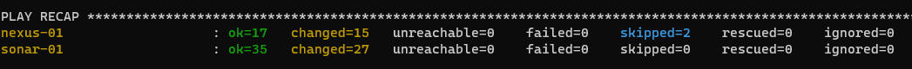

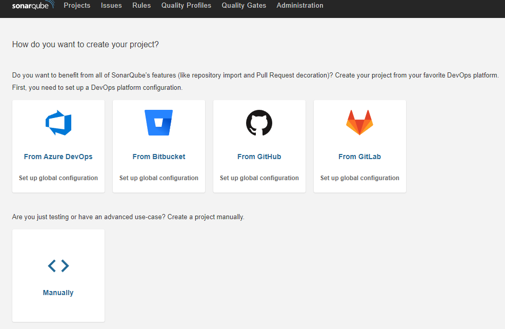

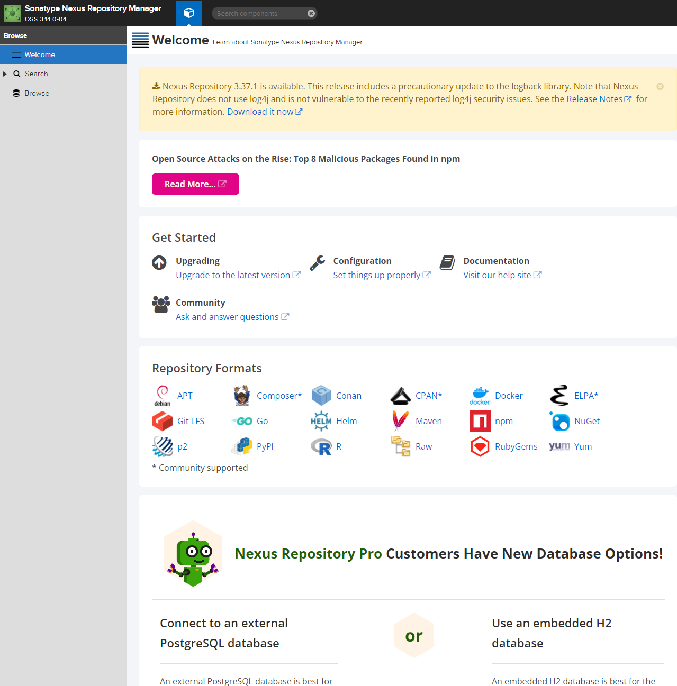

## Знакомоство с SonarQube

#### 1-2.

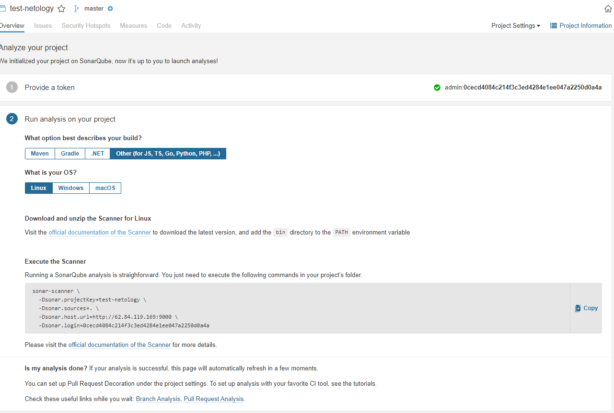

#### 3.
```bash 
$ cd sonar-scanner-4.6.2.2472-linux/
~/ansible/lesson-9.3/sonar-scanner-4.6.2.2472-linux$ ls
bin  conf  jre  lib
~/ansible/lesson-9.3/sonar-scanner-4.6.2.2472-linux$ export PATH=$PWD/bin:$PATH
```
#### 4.
```bash
~$ sonar-scanner --version
INFO: Scanner configuration file: /home/omi/ansible/lesson-9.3/sonar-scanner-4.6.2.2472-linux/conf/sonar-scanner.properties
INFO: Project root configuration file: NONE
INFO: SonarScanner 4.6.2.2472
INFO: Java 11.0.11 AdoptOpenJDK (64-bit)
INFO: Linux 5.4.0-91-generic amd64
```
#### 5.
```bash
$ sonar-scanner \
>   -Dsonar.projectKey=test-netology \
>   -Dsonar.sources=. \
>   -Dsonar.host.url=http://62.84.119.169:9000 \
>   -Dsonar.login=0cecd4084c214f3c3ed4284e1ee047a2250d0a4a \
>   -Dsonar.coverage.exclusions=fail.py
INFO: Scanner configuration file: /home/omi/ansible/lesson-9.3/sonar-scanner-4.6.2.2472-linux/conf/sonar-scanner.properties
INFO: Project root configuration file: NONE
INFO: SonarScanner 4.6.2.2472
INFO: Java 11.0.11 AdoptOpenJDK (64-bit)
INFO: Linux 5.4.0-91-generic amd64
INFO: User cache: /home/omi/.sonar/cache
INFO: Scanner configuration file: /home/omi/ansible/lesson-9.3/sonar-scanner-4.6.2.2472-linux/conf/sonar-scanner.properties
INFO: Project root configuration file: NONE
INFO: Analyzing on SonarQube server 9.1.0
INFO: Default locale: "en_US", source code encoding: "UTF-8" (analysis is platform dependent)
INFO: Load global settings
INFO: Load global settings (done) | time=297ms
INFO: Server id: 9CFC3560-AX3M4HtYbARZi_riYTwX
INFO: User cache: /home/omi/.sonar/cache
INFO: Load/download plugins
INFO: Load plugins index
INFO: Load plugins index (done) | time=151ms
INFO: Load/download plugins (done) | time=15024ms
INFO: Process project properties
INFO: Process project properties (done) | time=20ms
INFO: Execute project builders
INFO: Execute project builders (done) | time=4ms
INFO: Project key: test-netology
INFO: Base dir: /home/omi/ansible/lesson-9.3/role/example
INFO: Working dir: /home/omi/ansible/lesson-9.3/role/example/.scannerwork
INFO: Load project settings for component key: 'test-netology'
INFO: Load project settings for component key: 'test-netology' (done) | time=46ms
INFO: Load quality profiles
INFO: Load quality profiles (done) | time=136ms
INFO: Load active rules
INFO: Load active rules (done) | time=3465ms
INFO: Indexing files...
INFO: Project configuration:
INFO:   Excluded sources for coverage: fail.py
INFO: 1 file indexed
INFO: 0 files ignored because of scm ignore settings
INFO: Quality profile for py: Sonar way
INFO: ------------- Run sensors on module test-netology
INFO: Load metrics repository
INFO: Load metrics repository (done) | time=106ms
INFO: Sensor Python Sensor [python]
WARN: Your code is analyzed as compatible with python 2 and 3 by default. This will prevent the detection of issues specific to python 2 or python 3. You can get a more precise analysis by setting a python version in your configuration via the parameter "sonar.python.version"
INFO: Starting global symbols computation
INFO: 1 source file to be analyzed
INFO: Load project repositories
INFO: Load project repositories (done) | time=49ms
INFO: 1/1 source file has been analyzed
INFO: Starting rules execution
INFO: 1 source file to be analyzed
INFO: 1/1 source file has been analyzed
INFO: Sensor Python Sensor [python] (done) | time=2236ms
INFO: Sensor Cobertura Sensor for Python coverage [python]
INFO: Sensor Cobertura Sensor for Python coverage [python] (done) | time=21ms
INFO: Sensor PythonXUnitSensor [python]
INFO: Sensor PythonXUnitSensor [python] (done) | time=0ms
INFO: Sensor CSS Rules [cssfamily]
INFO: No CSS, PHP, HTML or VueJS files are found in the project. CSS analysis is skipped.
INFO: Sensor CSS Rules [cssfamily] (done) | time=1ms
INFO: Sensor JaCoCo XML Report Importer [jacoco]
INFO: 'sonar.coverage.jacoco.xmlReportPaths' is not defined. Using default locations: target/site/jacoco/jacoco.xml,target/site/jacoco-it/jacoco.xml,build/reports/jacoco/test/jacocoTestReport.xml
INFO: No report imported, no coverage information will be imported by JaCoCo XML Report Importer
INFO: Sensor JaCoCo XML Report Importer [jacoco] (done) | time=7ms
INFO: Sensor C# Project Type Information [csharp]
INFO: Sensor C# Project Type Information [csharp] (done) | time=2ms
INFO: Sensor C# Analysis Log [csharp]
INFO: Sensor C# Analysis Log [csharp] (done) | time=35ms
INFO: Sensor C# Properties [csharp]
INFO: Sensor C# Properties [csharp] (done) | time=1ms
INFO: Sensor JavaXmlSensor [java]
INFO: Sensor JavaXmlSensor [java] (done) | time=2ms
INFO: Sensor HTML [web]
INFO: Sensor HTML [web] (done) | time=10ms
INFO: Sensor VB.NET Project Type Information [vbnet]
INFO: Sensor VB.NET Project Type Information [vbnet] (done) | time=1ms
INFO: Sensor VB.NET Analysis Log [vbnet]
INFO: Sensor VB.NET Analysis Log [vbnet] (done) | time=57ms
INFO: Sensor VB.NET Properties [vbnet]
INFO: Sensor VB.NET Properties [vbnet] (done) | time=1ms
INFO: ------------- Run sensors on project
INFO: Sensor Zero Coverage Sensor
INFO: Sensor Zero Coverage Sensor (done) | time=1ms
INFO: SCM Publisher SCM provider for this project is: git
INFO: SCM Publisher 1 source file to be analyzed
INFO: SCM Publisher 0/1 source files have been analyzed (done) | time=141ms
WARN: Missing blame information for the following files:
WARN:   * fail.py
WARN: This may lead to missing/broken features in SonarQube
INFO: CPD Executor Calculating CPD for 1 file
INFO: CPD Executor CPD calculation finished (done) | time=28ms
INFO: Analysis report generated in 230ms, dir size=103.2 kB
INFO: Analysis report compressed in 21ms, zip size=14.3 kB
INFO: Analysis report uploaded in 87ms
INFO: ANALYSIS SUCCESSFUL, you can browse http://62.84.119.169:9000/dashboard?id=test-netology
INFO: Note that you will be able to access the updated dashboard once the server has processed the submitted analysis report
INFO: More about the report processing at http://62.84.119.169:9000/api/ce/task?id=AX3M7_SCbARZi_riYY1e
INFO: Analysis total time: 11.723 s
INFO: ------------------------------------------------------------------------
INFO: EXECUTION SUCCESS
INFO: ------------------------------------------------------------------------
INFO: Total time: 34.114s
INFO: Final Memory: 7M/27M
INFO: ------------------------------------------------------------------------
```
#### 6.
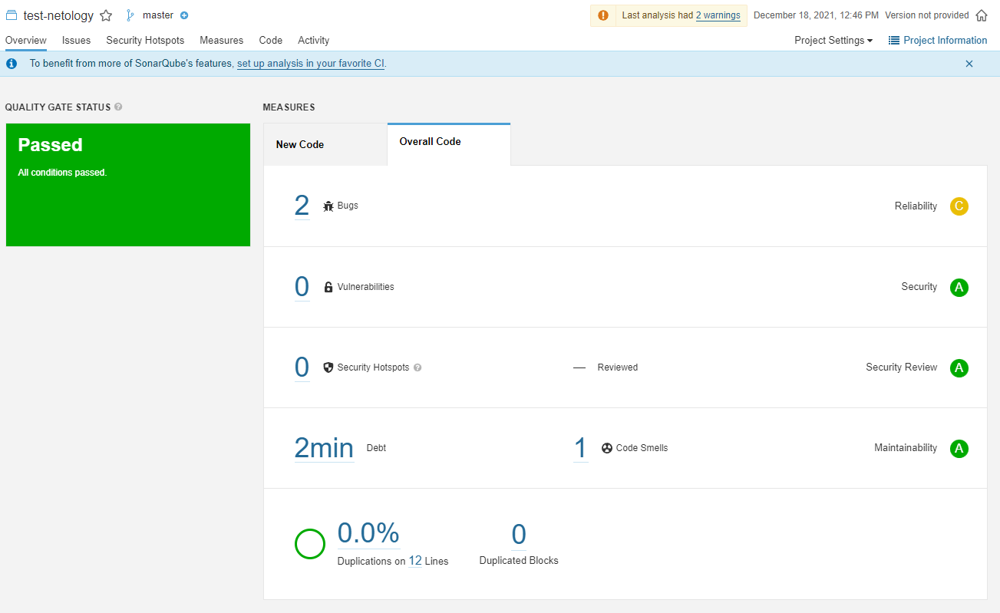
#### 7.
```bash
$ cat fail.py
def increment(index):
    return index + 1

def get_square(numb):
    return numb*numb
def print_numb(numb):
    print("Number is {}".format(numb))

index = 0
while (index < 10):
    index = increment(index)
    print(get_square(index))
```
#### 8 - 9
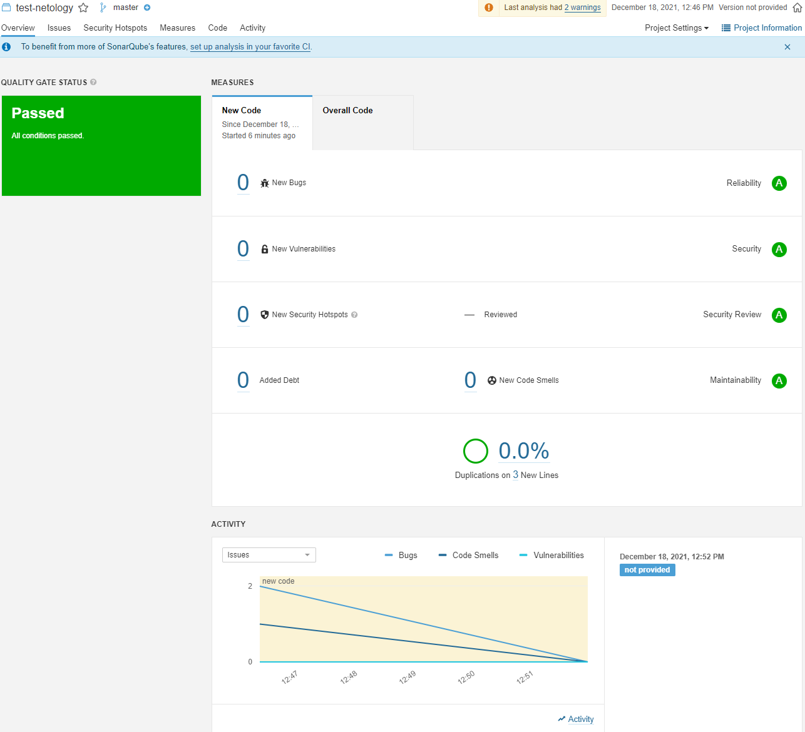

## Знакомство с Nexus

#### 1.
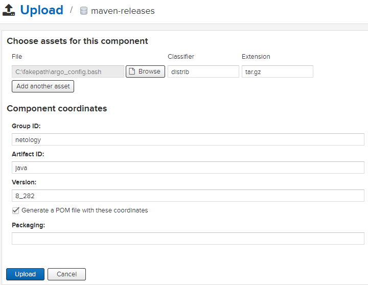
#### 2.
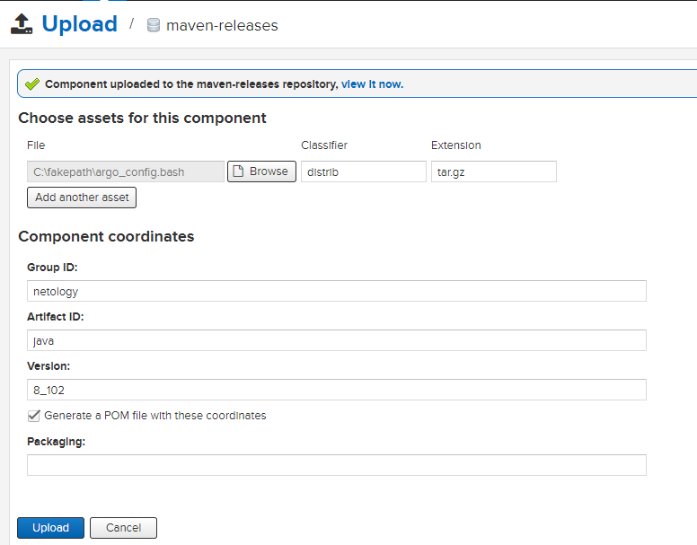
#### 3.
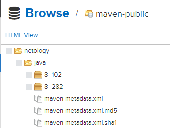


## Знакомство с Maven

#### 1 - 2.
```bash
~/ansible/lesson-9.3/apache-maven-3.8.4$ export PATH=$PWD/bin:$PATH
```
#### 3.
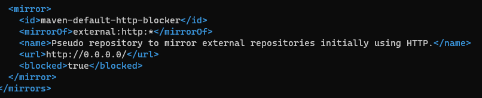

#### 4.
```bash
:~$ mvn --version
Apache Maven 3.8.4 (9b656c72d54e5bacbed989b64718c159fe39b537)
Maven home: /home/omi/ansible/lesson-9.3/apache-maven-3.8.4
Java version: 11.0.11, vendor: Ubuntu, runtime: /usr/lib/jvm/java-11-openjdk-amd64
Default locale: en_US, platform encoding: UTF-8
OS name: "linux", version: "5.4.0-91-generic", arch: "amd64", family: "unix"
```

#### 5.
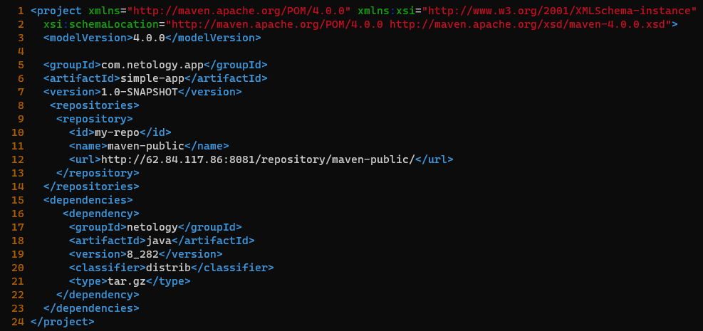

#### 6.
```bash
$ mvn package
[INFO] Scanning for projects...
[INFO]
[INFO] --------------------< com.netology.app:simple-app >---------------------
[INFO] Building simple-app 1.0-SNAPSHOT
[INFO] --------------------------------[ jar ]---------------------------------
Downloading from my-repo: http://62.84.117.86:8081/repository/maven-public/netology/java/8_282/java-8_282.pom
Downloaded from my-repo: http://62.84.117.86:8081/repository/maven-public/netology/java/8_282/java-8_282.pom (350 B at 1.6 kB/s)
Downloading from my-repo: http://62.84.117.86:8081/repository/maven-public/netology/java/8_282/java-8_282-distrib.tar.gz
Downloaded from my-repo: http://62.84.117.86:8081/repository/maven-public/netology/java/8_282/java-8_282-distrib.tar.gz (1.7 kB at 32 kB/s)
[INFO]
[INFO] --- maven-resources-plugin:2.6:resources (default-resources) @ simple-app ---
[WARNING] Using platform encoding (UTF-8 actually) to copy filtered resources, i.e. build is platform dependent!
[INFO] skip non existing resourceDirectory /home/omi/ansible/lesson-9.3/role/mvn/src/main/resources
[INFO]
[INFO] --- maven-compiler-plugin:3.1:compile (default-compile) @ simple-app ---
[INFO] No sources to compile
[INFO]
[INFO] --- maven-resources-plugin:2.6:testResources (default-testResources) @ simple-app ---
[WARNING] Using platform encoding (UTF-8 actually) to copy filtered resources, i.e. build is platform dependent!
[INFO] skip non existing resourceDirectory /home/omi/ansible/lesson-9.3/role/mvn/src/test/resources
[INFO]
[INFO] --- maven-compiler-plugin:3.1:testCompile (default-testCompile) @ simple-app ---
[INFO] No sources to compile
[INFO]
[INFO] --- maven-surefire-plugin:2.12.4:test (default-test) @ simple-app ---
[INFO] No tests to run.
[INFO]
[INFO] --- maven-jar-plugin:2.4:jar (default-jar) @ simple-app ---
[WARNING] JAR will be empty - no content was marked for inclusion!
[INFO] Building jar: /home/omi/ansible/lesson-9.3/role/mvn/target/simple-app-1.0-SNAPSHOT.jar
[INFO] ------------------------------------------------------------------------
[INFO] BUILD SUCCESS
[INFO] ------------------------------------------------------------------------
[INFO] Total time:  3.069 s
[INFO] Finished at: 2021-12-18T10:18:20Z
[INFO] ------------------------------------------------------------------------
```
#### 7.
```bash
$ ls -la ~/.m2/repository/ | grep netology
drwxrwxr-x  3 omi omi 4096 Dec 18 10:14 netology
```