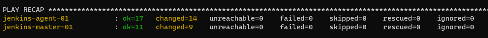
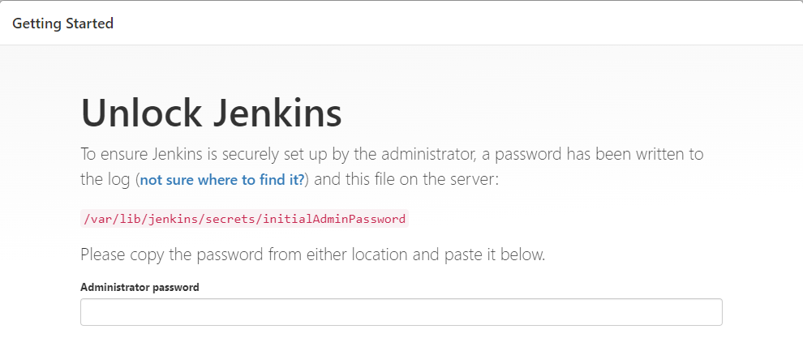
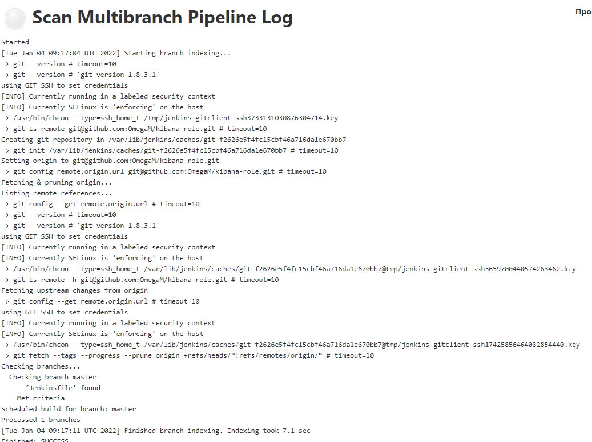
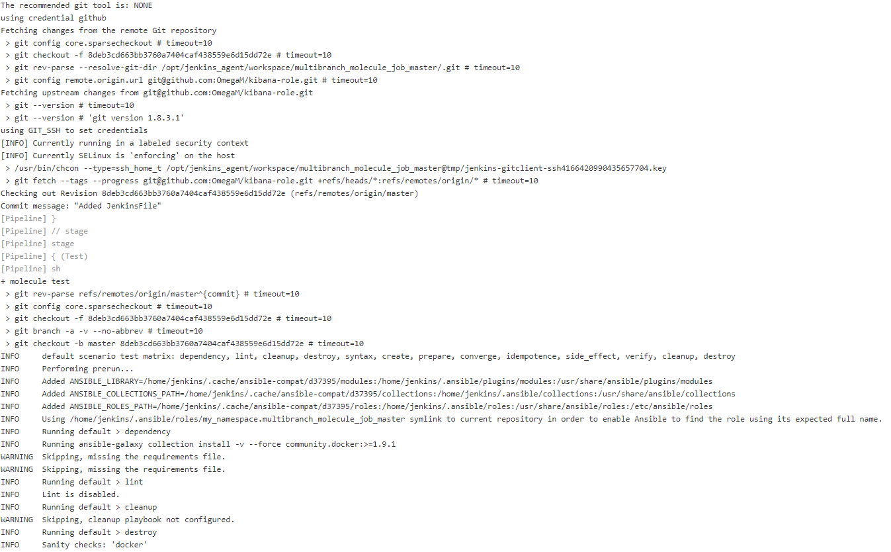
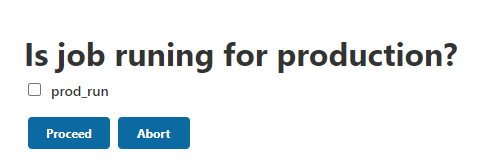
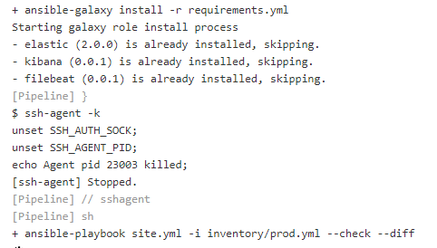
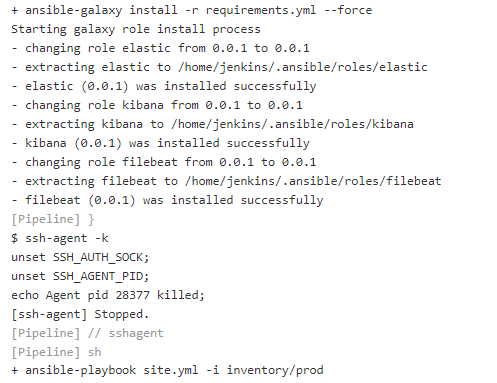
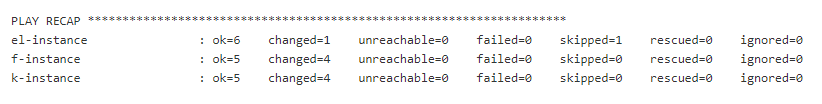

# 09.04 Jenkins






#### 1. 
```bash
python3 -m pip install molecule
python3 -m pip install molecule['docker']
molecule test
```
#### 2.
```yaml
pipeline{
    agent any
    stages{
        stage('SCM'){
            steps{
                git credentialsId: 'github', url: 'git@github.com:OmegaM/kibana-role.git'
            }
        }
        
        stage('Test'){
            steps{
                sh 'molecule test'
            }
        }
        
    }
}
```
#### 3-4.


#### 5-6.
```yaml
node("linux"){
    stage("Git checkout"){
        git credentialsId: 'github', url: 'git@github.com:OmegaM/ansible.git'
    }
    stage("Sample define secret_check"){
        secret_check=true
        prod_run = input(message: 'Is job runing for production?', parameters: [booleanParam(defaultValue: false, name: 'prod_run')])
    }
    stage("Run playbook"){
        
        if (secret_check){
            dir('lesson-8-4') {
                sshagent(credentials: ['github']) {
                    sh 'ansible-galaxy install -r requirements.yml'
                }
                if (prod_run){
                    sh 'ansible-playbook site.yml -i inventory/prod.yml'
                }else{
                    sh 'ansible-playbook site.yml -i inventory/prod.yml --check --diff'
                }
            }
        }
        else{
            echo 'need more action'
        }

    }
}
```
#### 6.



#### 7.


