# 09.05 Teamcity


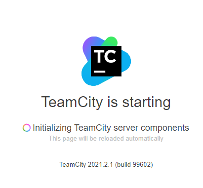
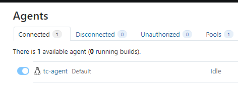
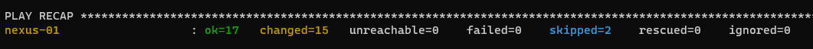

#### 1-2.
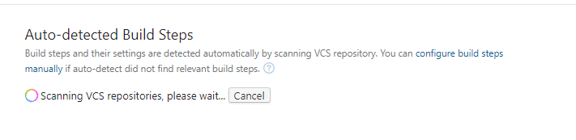

#### 3.
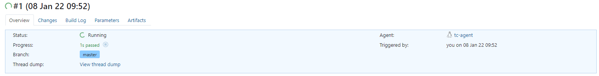
#### 4.
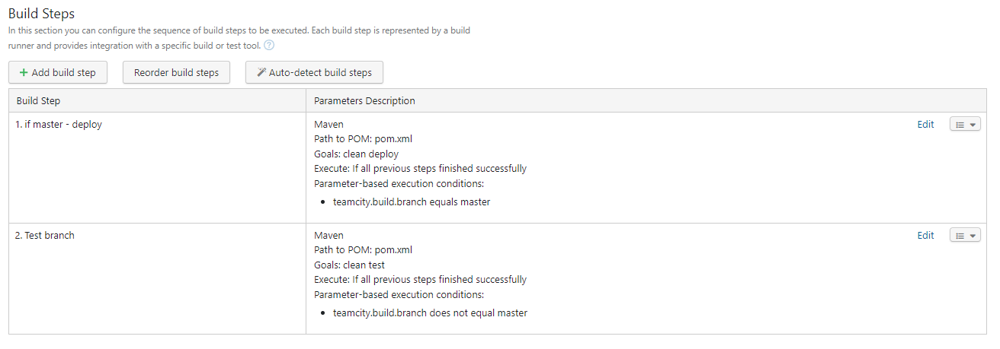
#### 5.
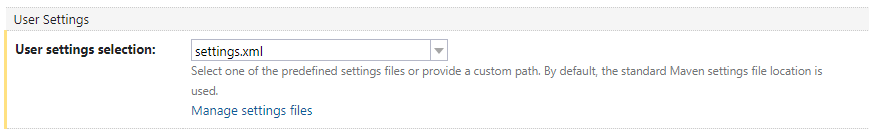
#### 6.
https://github.com/OmegaM/example-teamcity/commit/cf9eda4450ae1d78753b2360c0faed543d6a1bb5
#### 7.
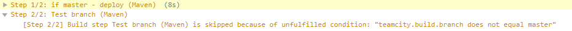
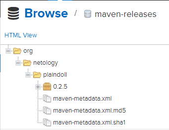
#### 8.
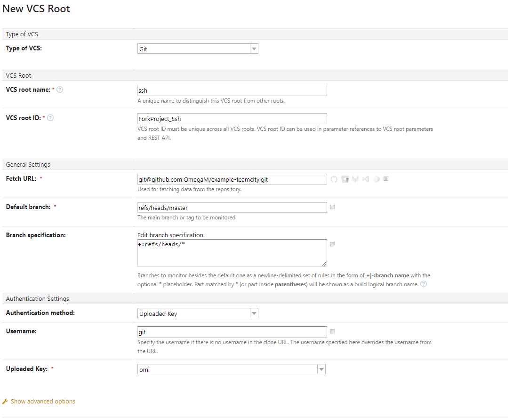
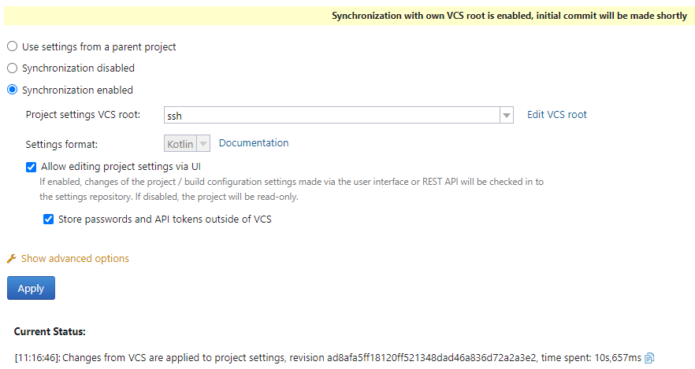
https://github.com/OmegaM/example-teamcity/commit/ad8afa5ff18120ff521348dad46a836d72a2a3e2
#### 9.
```bash
$ git switch -c feature/add_reply ; git push -u origin feature/add_reply
Switched to a new branch 'feature/add_reply'
Total 0 (delta 0), reused 0 (delta 0)
remote:
remote: Create a pull request for 'feature/add_reply' on GitHub by visiting:
remote:      https://github.com/OmegaM/example-teamcity/pull/new/feature/add_reply
remote:
To github.com:OmegaM/example-teamcity.git
 * [new branch]      feature/add_reply -> feature/add_reply
Branch 'feature/add_reply' set up to track remote branch 'feature/add_reply' from 'origin'.
```
#### 10.
```java
...
 public String sayTestReplic() {
    return "Test hunter replic here!";
}
```
#### 11.
```java
...
@Test
 public void testHunterReplic(){
    assertThat(welcomer.sayTestReplic(), containsString("hunter"));
}
```
#### 12.
```bash
$ git commit -m "Added test public method + Unit test"
[feature/add_reply b66587e] Added test public method + Unit test
 2 files changed, 8 insertions(+), 1 deletion(-)
$ git push
Enumerating objects: 20, done.
Counting objects: 100% (20/20), done.
Delta compression using up to 4 threads
Compressing objects: 100% (6/6), done.
Writing objects: 100% (11/11), 835 bytes | 139.00 KiB/s, done.
Total 11 (delta 3), reused 0 (delta 0)
remote: Resolving deltas: 100% (3/3), completed with 3 local objects.
To github.com:OmegaM/example-teamcity.git
   ad8afa5..b66587e  feature/add_reply -> feature/add_reply
```
#### 13.
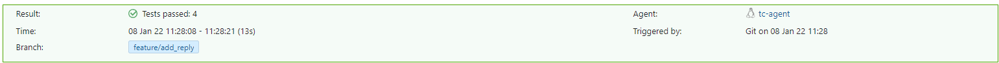
#### 14.
```bash
$ git checkout master ; git merge feature/add_reply; git push
Switched to branch 'master'
Your branch is up to date with 'origin/master'.
Updating ad8afa5..b66587e
Fast-forward
 src/main/java/plaindoll/Welcomer.java     | 3 +++
 src/test/java/plaindoll/WelcomerTest.java | 6 +++++-
 2 files changed, 8 insertions(+), 1 deletion(-)
Total 0 (delta 0), reused 0 (delta 0)
To github.com:OmegaM/example-teamcity.git
   ad8afa5..b66587e  master -> master
```
#### 15.
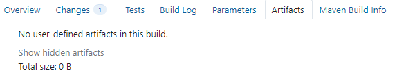
#### 16.
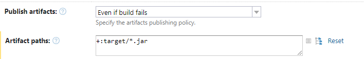
#### 17.

#### 18.
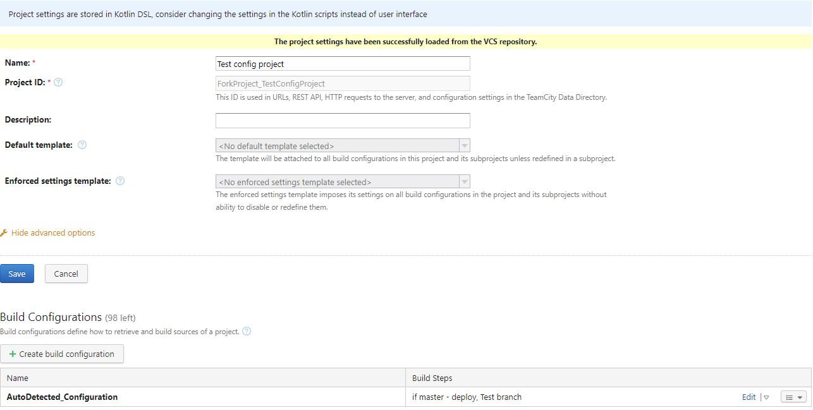
