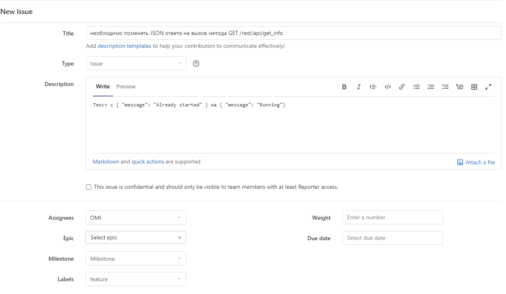
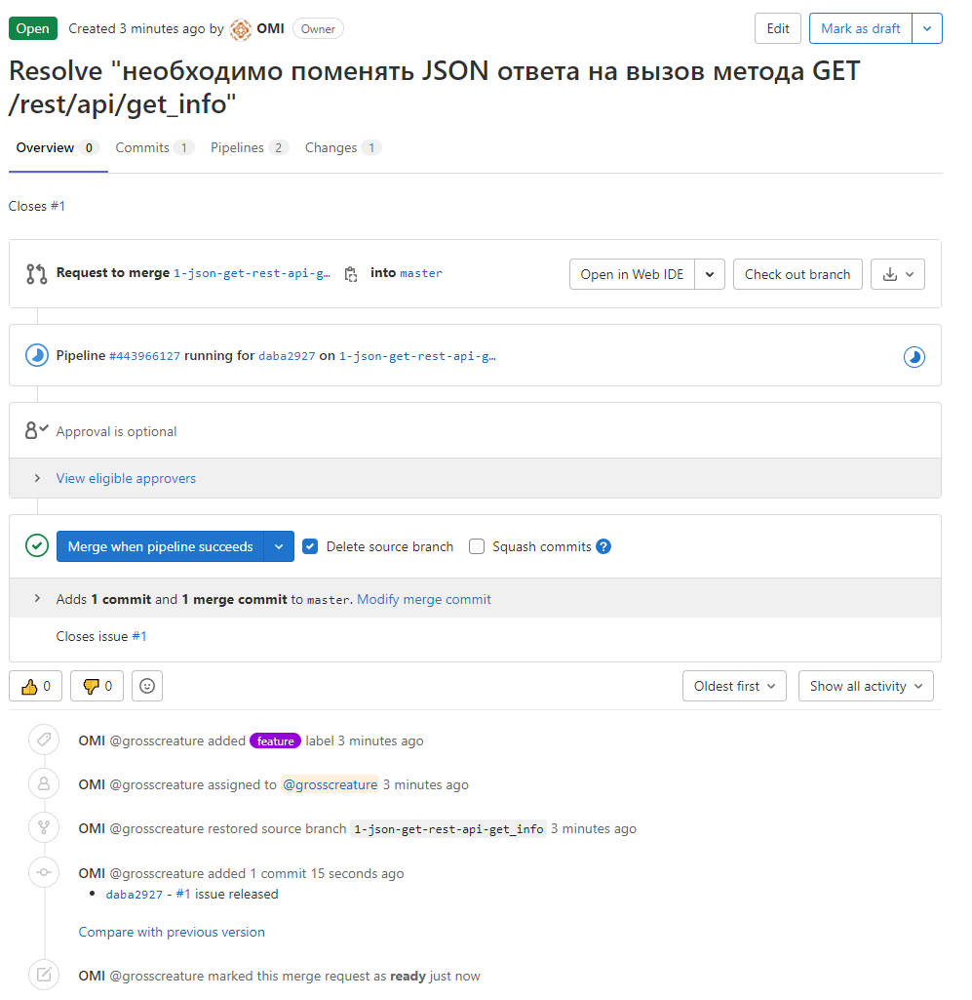
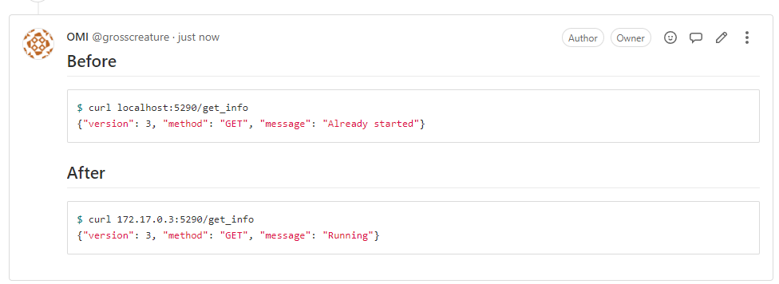

# 09.06 Gitlab

## DevOps

#### 1-6.
```bash
FROM centos:7

WORKDIR /tmp

RUN yum -y install wget make gcc openssl-devel bzip2-devel libffi-devel && \
    wget https://www.python.org/ftp/python/3.7.9/Python-3.7.9.tgz && \
    tar xzf Python-3.7.9.tgz && \
    cd Python-3.7.9 && \
    ./configure --enable-optimizations && \
    make altinstall && \
    ln -sfn /usr/local/bin/python3.7 /usr/bin/python3.7 && \
    ln -sfn /usr/local/bin/pip3.7 /usr/bin/pip3.7

RUN mkdir /python_api
COPY * /python_api/

WORKDIR /python_api
RUN    pip3.7 install -r requirements.txt

CMD ["python3.7", "/python_api/python-api.py"]
```
#### 7.
```yaml
image: docker:20.10.5
services: 
    - docker:20.10.5-dind
build:
    stage: build
    script:
        - docker build -t ${CI_PROJECT_NAME}:${CI_COMMIT_SHA} . 
    except:
        refs:
            - master
deploy:
    stage: deploy
    script:
        - docker login -u ${CI_REGISTRY_USER} -p ${CI_REGISTRY_PASSWORD} ${CI_REGISTRY}
        - docker build -t ${CI_REGISTRY}/${CI_PROJECT_NAMESPACE}/${CI_PROJECT_NAME}/python-api:latest . #registry.gitlab.com/n2460/devops-netology 
        - docker push ${CI_REGISTRY}/${CI_PROJECT_NAMESPACE}/${CI_PROJECT_NAME}/python-api:latest
    only:
        refs:
            - master 

```
## Product Owner

#### 1-3.


## Developer

#### 1-3.


## Tester

#### 1.
```bash
$ docker run -p 5290:5290 --rm --name issue -d registry.gitlab.com/n2460/devops-netology/python-api
bb50d05b92b8bfab0fa03fc1b0ade9f17341fecaa52575ac173b863d7ab6dea0
```
#### 2.
