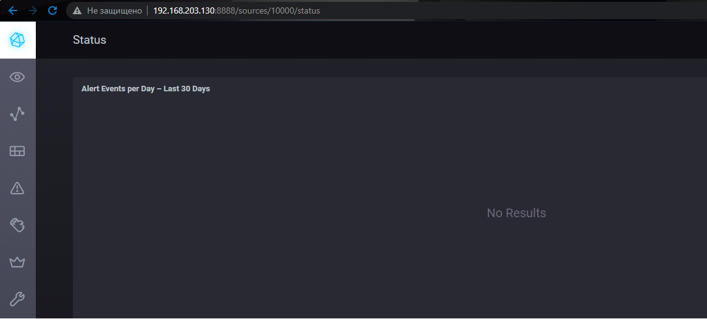
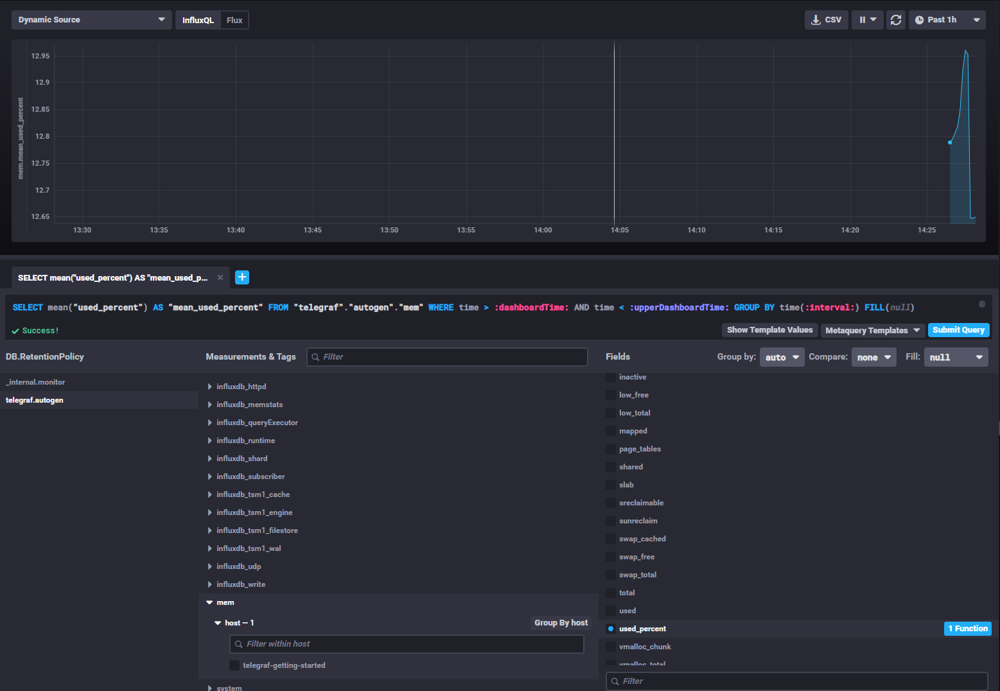
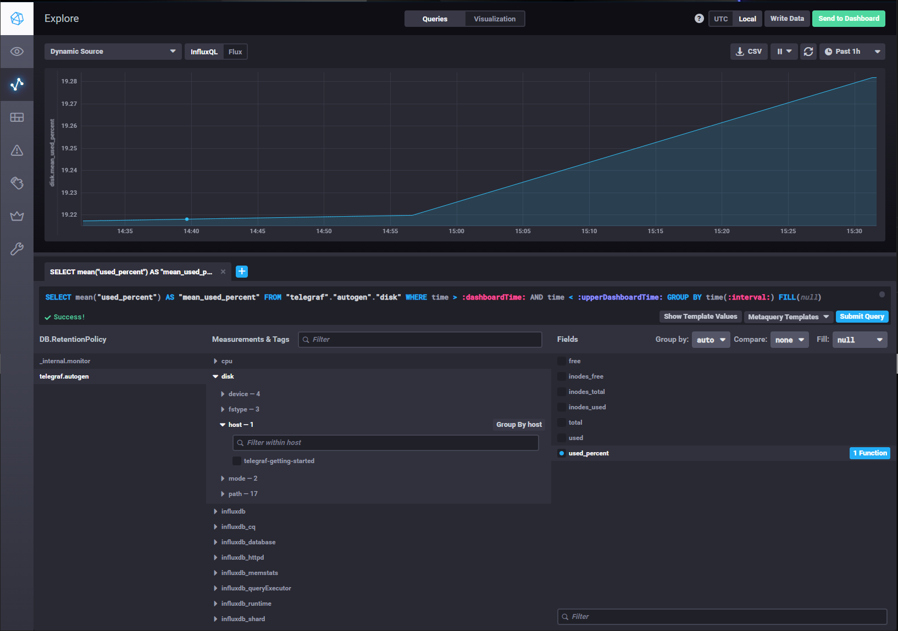
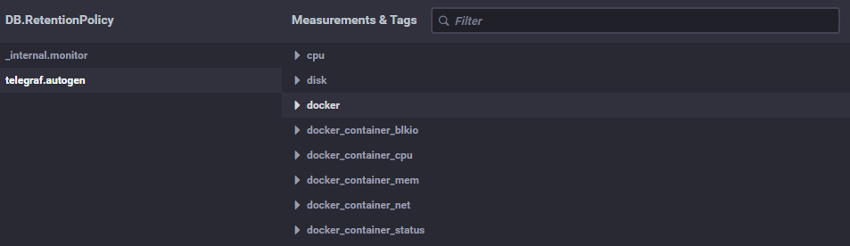

# 10.02. Системы мониторинга

#### 1.
##### PUSH
    - Плюсы : 
        - Возможность использования прокси для агентов собирающих метрики.
        - Возможность более гибко настроить отправку данных с агентов.
    - Минусы :
        - В случае использования большого кол-ва агентов, настройка каждого из них становиться проблемой


##### PULL
    - Плюсы :
        - Возможность настройки Service Discovery, что позволит не настраивать большое кол-во агентов вручную
        - Возможность ручного сбора метрик.

#### 2.
 - Prometheus 
    - Pull система, с возможностью настройки Push Geteway - сервис, который позволяет сэмитировать PUSH модель.
 - TICK
    - Telegraf передает данные в InfluxDB по PUSH моделе.
 - Zabbix
    - Гибридная модель.
 - VictoriaMetrics
    - PUSH модель. Позволяет собирать и хранить метрики одновременнно с разных сервисов, включая Prometheus.
 - Nagios
    - PULL модель.
#### 3.
```bash
$ curl -v http://localhost:8086/ping
*   Trying 127.0.0.1:8086...
* TCP_NODELAY set
* Connected to localhost (127.0.0.1) port 8086 (#0)
> GET /ping HTTP/1.1
> Host: localhost:8086
> User-Agent: curl/7.68.0
> Accept: */*
>
* Mark bundle as not supporting multiuse
< HTTP/1.1 204 No Content
< Content-Type: application/json
< Request-Id: 07950269-7b71-11ec-80c9-0242ac140002
< X-Influxdb-Build: OSS
< X-Influxdb-Version: 1.8.10
< X-Request-Id: 07950269-7b71-11ec-80c9-0242ac140002
< Date: Sat, 22 Jan 2022 10:49:53 GMT
<
* Connection #0 to host localhost left intact

$ curl -v http://localhost:8888
*   Trying 127.0.0.1:8888...
* TCP_NODELAY set
* Connected to localhost (127.0.0.1) port 8888 (#0)
> GET / HTTP/1.1
> Host: localhost:8888
> User-Agent: curl/7.68.0
> Accept: */*
>
* Mark bundle as not supporting multiuse
< HTTP/1.1 200 OK
< Accept-Ranges: bytes
< Cache-Control: public, max-age=3600
< Content-Length: 336
< Content-Security-Policy: script-src 'self'; object-src 'self'
< Content-Type: text/html; charset=utf-8
< Etag: "336820331"
< Last-Modified: Fri, 08 Oct 2021 20:33:01 GMT
< Vary: Accept-Encoding
< X-Chronograf-Version: 1.9.1
< X-Content-Type-Options: nosniff
< X-Frame-Options: SAMEORIGIN
< X-Xss-Protection: 1; mode=block
< Date: Sat, 22 Jan 2022 10:45:14 GMT
<
* Connection #0 to host localhost left intact
<!DOCTYPE html><html><head><meta http-equiv="Content-type" content="text/html; charset=utf-8"><title>Chronograf</title><link rel="icon shortcut" href="/favicon.fa749080.ico"><link rel="stylesheet" href="/src.3dbae016.css"></head><body> <div id="react-root" data-basepath=""></div> <script src="/src.fab22342.js"></script> </body></html>

$ curl -v http://localhost:9092/kapacitor/v1/ping
*   Trying 127.0.0.1:9092...
* TCP_NODELAY set
* Connected to localhost (127.0.0.1) port 9092 (#0)
> GET /kapacitor/v1/ping HTTP/1.1
> Host: localhost:9092
> User-Agent: curl/7.68.0
> Accept: */*
>
* Mark bundle as not supporting multiuse
< HTTP/1.1 204 No Content
< Content-Type: application/json; charset=utf-8
< Request-Id: 16802bd1-7b71-11ec-8072-000000000000
< X-Kapacitor-Version: 1.6.2
< Date: Sat, 22 Jan 2022 10:50:18 GMT
<
* Connection #0 to host localhost left intact
```


#### 4.
```bash
$ cat telegraf/telegraf.conf
...
[[inputs.disk]]
[[inputs.mem]]
[[inputs.cpu]]
[[inputs.system]]
...
```


#### 5.
```bash
$ cat docker-compose.yml
...
telegraf:
    # Full tag list: https://hub.docker.com/r/library/telegraf/tags/
    build:
      context: ./images/telegraf/
      dockerfile: ./${TYPE}/Dockerfile
      args:
        TELEGRAF_TAG: ${TELEGRAF_TAG}
    image: "telegraf"
    privileged: true
    user: telegraf:1001
    environment:
      HOSTNAME: "telegraf-getting-started"
    # Telegraf requires network access to InfluxDB
    links:
      - influxdb
    volumes:
      # Mount for telegraf configuration
      - ./telegraf/:/etc/telegraf/
      # Mount for Docker API access
      - /var/run/docker.sock:/var/run/docker.sock
    depends_on:
      - influxdb
...
```

