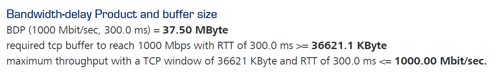
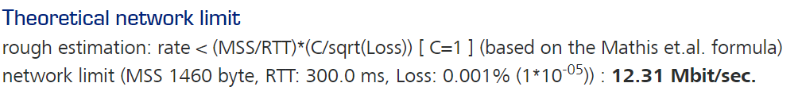
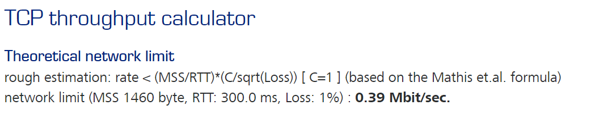

# 3.7. Компьютерные сети, лекция 2

#### 1.
rwin = rtt * throughput 

rwin = 300 * 1Гбит/с = 37500000/8 = 36621 kbyte

[Калькулятор](https://www.switch.ch/network/tools/tcp_throughput/)


#### 2.


(12.31 Mbit/s) / (0.40 Mbit/s) = 30,8

#### 3.
Ethernet Frame = 1518 byte
MTU = 1518 - 14(Ethernet Header) + 4 (Ethernet Trailer) = 1500 byte 
payload = 1500 - (20(IP Header) + 20(TCP Header)) = 1460 bytes

(1460 / 1518) * 100 = 96.18% (96,18 Mbit/s)

#### 4.
1. Получение IP адресса http://netology.ru (см. п.5)
```
10.0.2.15 → 10.0.2.3     DNS 71 Standard query 0x76a0 A netology.ru
10.0.2.15 → 10.0.2.3     DNS 71 Standard query 0x708a AAAA netology.ru
10.0.2.3 → 10.0.2.15    DNS 119 Standard query response 0x76a0 A netology.ru A 104.22.49.171 A 104.22.48.171 A 172.67.43.83
10.0.2.3 → 10.0.2.15    DNS 155 Standard query response 0x708a AAAA netology.ru AAAA 2606:4700:10::6816:31ab AAAA 2606:4700:10::ac43:2b53 AAAA 2606:4700:10::6816:30ab
```
2. Отправка запроса на опрос локальной сети, для отправки запросов на хост
```
PcsCompu_14:86:db → RealtekU_12:35:03 ARP 42 Who has 10.0.2.3? Tell 10.0.2.15
RealtekU_12:35:03 → PcsCompu_14:86:db ARP 60 10.0.2.3 is at 52:54:00:12:35:03
```
3. Отправка запроса на SYN 
```
10.0.2.15 → 172.67.43.83 TCP 74 41732 → 80 [SYN] Seq=0 Win=64240
```
4.Получение ответа от сервера 
```
172.67.43.83 → 10.0.2.15    TCP 60 80 → 41732 [SYN, ACK] Seq=0 Ack=1 Win=65535
```
5.Получение заголовка на редирект
```
172.67.43.83 → 10.0.2.15    HTTP 451 HTTP/1.1 301 Moved Permanently
```
6.Отправка запроса на разрыв соединения
```
10.0.2.15 → 172.67.43.83 TCP 54 41734 → 80 [FIN, ACK] Seq=77 Ack=398
```
7.Получение ответа от сервера
```
172.67.43.83 → 10.0.2.15    TCP 60 80 → 41736 [FIN, ACK] Seq=398 Ack=78 Win=65535
```
#### 5.
для www.google.co.uk :

1. Обращение к корневому DNS
2. Обращение к DNS сегмента uk
3. Перенаправление в сегмент co.uk
4. Перенаправление в сегмент google.co.uk 
5. Получение IP адресса
#### 6.
/25 - 126 хостов

255.248.0.0 (/13)- 524286 хостов
#### 7.
[cisco.com](https://www.cisco.com/c/ru_ru/support/docs/ip/routing-information-protocol-rip/13790-8.html)

Таблица хостов/подсети класса A
                               
количество битов, заимствованных из адресной части хоста  |Маска подсети|Число возможных подсетей|Число хостов/подсеть|Число битов в маске подсети
-------------------------------------------------------------------|-------------|------------------------|---------------------|-------------------------- 
  ...|...|...|...|...|
  15|                   255.255.254.0 |     32768              |510 |          /23|
  16|                   255.255.255.0 |     65536              |254 |          /24|
  ...|...|...|...|...|
#### 8.
10.0.0.0/8 = 2 ^ 24 = 16777216 хостов

128 * 131070 + (128 * 2) = 16777216 хостов

128 = 2^7 + /8 = /15 (конечная маска)