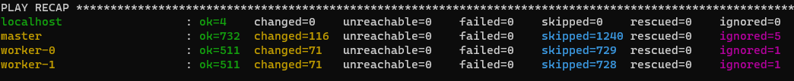

# 12.4 Развертывание кластера на собственных серверах, лекция 2

#### 1
Для подготовки кластера использовался terraform manifest

Inventory
```ini
[all]
master ansible_host=51.250.73.101 ansible_user=ubuntu 
worker-0 ansible_host=51.250.70.221 ansible_user=ubuntu 
worker-1 ansible_host=51.250.69.202 ansible_user=ubuntu 

[kube_control_plane]
master


[etcd]
master

[kube_node]
worker-0
worker-1


[calico_rr]

[k8s_cluster:children]
kube_control_plane
kube_node
calico_rr
```

```yml
## Container runtime
## docker for docker, crio for cri-o and containerd for containerd.
## Default: containerd
container_manager: containerd
```

#### 2.


```bash
omi@ubuntu-server:~/kubespray$ kubectl get nodes
NAME       STATUS   ROLES                  AGE   VERSION
master     Ready    control-plane,master   32m   v1.23.5
worker-0   Ready    <none>                 31m   v1.23.5
worker-1   Ready    <none>                 31m   v1.23.5

omi@ubuntu-server:~/kubespray$ kubectl create deploy nginx --image=nginx:latest --replicas=2
deployment.apps/nginx created

omi@ubuntu-server:~/kubespray$ kubectl get po -o wide
NAME                     READY   STATUS    RESTARTS   AGE     IP             NODE       NOMINATED NODE   READINESS GATES
nginx-7c658794b9-2gsk8   1/1     Running   0          2m33s   10.233.108.1   worker-0   <none>           <none>
nginx-7c658794b9-hrjcq   1/1     Running   0          2m33s   10.233.73.2    worker-1   <none>           <none>
```
